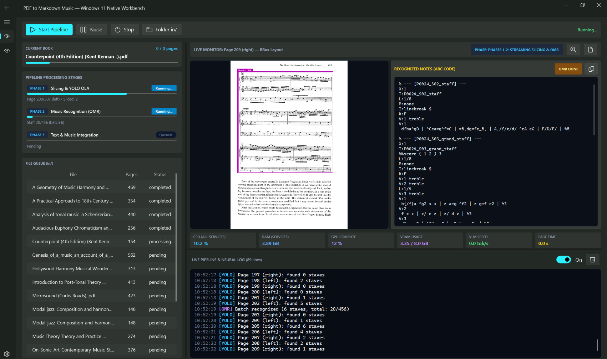

# solfeggio2md

Convert music theory textbooks and sheet music PDFs into Markdown with embedded ABC notation and vector SVG scores. Runs locally within an 8 GB VRAM budget (RTX 3060, 4060, 4070, 5070 Mobile).



---

## Quick Start (Windows)

1. Download or clone this repository.
2. Double-click `install.bat` (it sets up Python, PyTorch with CUDA, and all dependencies automatically).
3. Double-click `start.bat`.

*(If you skip `install.bat`, launching `start.bat` will detect the missing setup and offer to install it for you).*

### Text OCR Setup

To transcribe non-music textbook text alongside the staves, run [LM Studio](https://lmstudio.ai/) in the background:
1. Load `Qwen3.5-9B` (recommended) or `Qwen2.5-VL-7B-Instruct`.
2. Click "Start Server" on port 1234.
3. Solfeggio OCR Studio connects to it automatically.

Alternatively, open the app, go to the Settings tab, and click "Download Model" to download the model directly.

**Important**: The prompts, text extraction, and stub-tag preservation were tuned and tested specifically on **Qwen3.5-9B** (and **Qwen2.5-VL-7B**). Smaller or weaker vision models (e.g. 2B or 3B) often lose the `<!-- MUSIC_STUB_ID -->` tags or miss text in dense book layouts. If you choose to run smaller models, expect degraded results.

All other neural weights (YOLO layout detector 38 MB, Transcoda OMR, SMT) download automatically on first run.

---

## Linux / Manual Setup

```bash
git clone https://github.com/greenyamao/solfeggio2md.git
cd solfeggio2md

python3 -m venv .venv
source .venv/bin/activate

pip install torch torchvision --index-url https://download.pytorch.org/whl/cu128
pip install -r requirements.txt

python run_native_app.py
```

---

## How It Works

Standard OCR tools mangle musical staves, while general Vision LLMs hallucinate notes and run out of memory. This pipeline runs 4 sequential steps to solve that:

1. **Layout & Deskew**: Splits two-page spreads down the gutter, levels slanted staves with a GPU 2D-FFT (~1 ms), and locates staves using YOLO OLA v2.0. Staves are whited out from the page image and replaced with placeholder tags (`<!-- MUSIC_STUB_ID:P0001_S01 -->`).
2. **Music Recognition (OMR)**: Staves are extracted and enhanced with a lightweight Real-CUGAN 2x U-Net. Single staves route to Transcoda-59M, while piano grand staves route to SMT. Output is generated in Humdrum `**kern` format.
3. **Validation & ABC Conversion**: Validates measure durations against time signatures (4/4, 3/4, 6/8), ensures spine columns stay balanced, runs the C++ Verovio engine to compile MusicXML, and converts to multi-voice ABC (`V:1 treble`, `V:2 bass`) via `xml2abc`.
4. **Text OCR & Assembly**: A local Vision LLM reads the masked page. Because notes are whited out, it transcribes the text and headings cleanly without hallucinating music, preserving the stub tags. The stub tags are then swapped for the compiled ABC notation and vector SVGs.

### Memory Management (8 GB VRAM)

Models run sequentially rather than concurrently. Each model unloads before the next one loads, keeping peak VRAM under ~6.2 GB:

- Phase 1 (Layout & Deskew): ~1.4 GB VRAM -> purged
- Phase 2 (Music OMR): ~3.8 GB VRAM -> purged
- Phase 3 (Verovio Validation): 0 GB VRAM (CPU only)
- Phase 4 (Text OCR): ~6.2 GB VRAM

---

## CLI & Debug Tools

```bash
# Run batch conversion on PDFs in in/
python -m core.pipeline_batch_runner

# Quick 1-line page count and status check
python -m tools.debug_toolkit audit --book "in/Book.pdf"

# Inspect layout detection on a specific page
python -m tools.debug_toolkit page --book "in/Book.pdf" --page 25 --render

# Scan a page range for split staves or layout issues
python -m tools.debug_toolkit scan --book "in/Book.pdf" --range 1-50

# Run the 117-test regression suite
python tests/run_tests.py
```

---

## Configuration (config.json)

The default configuration is already tuned for 8 GB GPUs. You can adjust settings via the GUI Settings tab or directly in `config.json`:

```json
{
  "vlm_backend": "embedded",
  "vlm_model_file": "Qwen3.5-9B-Q4_K_M.gguf",
  "vlm_mmproj_file": "mmproj-Qwen3.5-9B-BF16.gguf",
  "vlm_embedded_port": 1234,
  "dpi": 200,
  "enable_score_enhancer": true,
  "enable_cugan_sr": true,
  "keep_intermediate_files": false,
  "overwrite": false
}
```

---

## Credits

- [Sheet Music Transformer (SMT)](https://github.com/antoniorv6/SMT) by Antonio Ríos-Vila (MIT License, see `core/smt_model/LICENSE`).
- [OMR Layout Analysis (OLA v2.0)](https://github.com/v-dvorak/omr-layout-analysis) by Charles University.
- [Transcoda-59M](https://huggingface.co/btrkeks/transcoda-59M-zeroshot-v1) by btrkeks.
- [Verovio](https://www.verovio.org/) C++ music engraving library (LGPL).
- [xml2abc](https://github.com/sebastian-eck/abc_xml_converter) by Willem Vree.
- Real-CUGAN for line restoration.

---

## License

Apache License 2.0. See [LICENSE](LICENSE) for details.